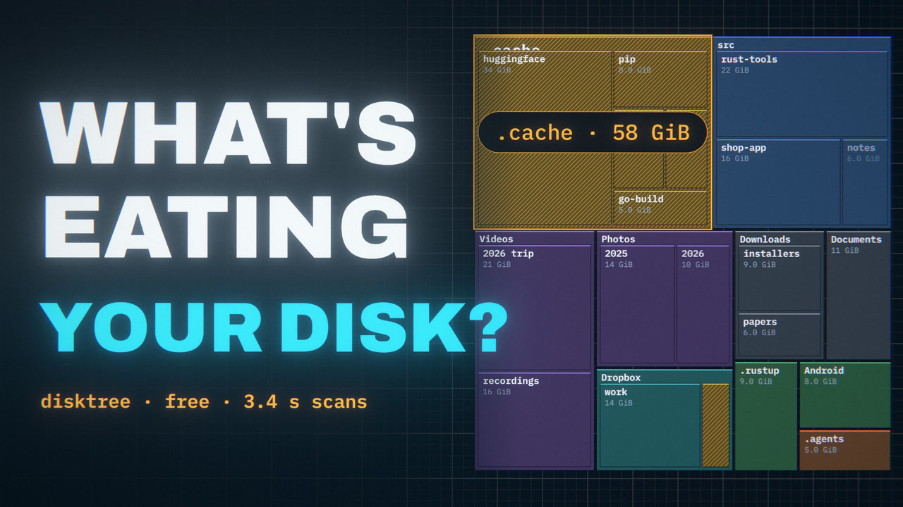
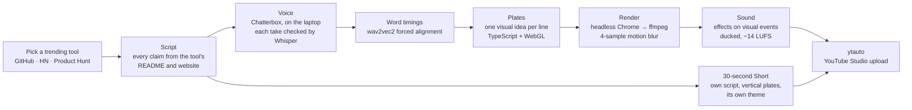

# Hermes

**A YouTube channel that runs from a Windows laptop.** Every video explains one developer tool that is trending this week. The script is fact-checked against the tool's own pages, the voice is generated locally, the animation is written as code, and a browser robot uploads the result to YouTube Studio.

Channel: **[Tool Man (@tooladay)](https://www.youtube.com/@tooladay)**, one new tool every day.

[](https://youtu.be/4MmSMJ2c2aQ)

**Latest:** [Shopify's Founder Built a Free Disk Cleaner: 4 Million Files in 3.4 Seconds](https://youtu.be/4MmSMJ2c2aQ) (1:30) · [the Short](https://youtube.com/shorts/vZ9y7XhO3pc) (0:30) · about [disktree](https://github.com/tobi/disktree)

Each video has its own look. The 90-second videos and the 30-second vertical Shorts are written, voiced, animated and rendered separately; a Short is not a reformat of the video.

---

## What's in this repository

| Folder | What it does | Built with |
|---|---|---|
| [`Motion_as_kit/`](Motion_as_kit/) | Makes the videos. Each video is an episode folder with its own script, voice, theme and TypeScript "plates", which draw every frame as a function of time, locked to the voiceover's word timings. Headless Chrome renders them with motion blur. | three.js / WebGL, Vite, Playwright, ffmpeg, Chatterbox, wav2vec2 |
| [`yt-automation/`](yt-automation/) | **ytauto** uploads the videos. It is a queue that fills in the title, description, tags, thumbnail and AI-content disclosure in YouTube Studio through a signed-in Chrome profile, then publishes or schedules. | Python, Playwright, SQLite |
| [`tech-daily/`](tech-daily/) | **techdaily**, the earlier daily pipeline. It collects trending tools from GitHub, Hacker News, Product Hunt, Reddit and Google Trends, researches one, fact-checks a script and builds a HyperFrames video. | Python, Claude Code (`claude -p`), HyperFrames |

[Hermes Agent](https://github.com/NousResearch/hermes-agent) runs the schedule (`ytauto tick` every 10 minutes) and [Claude Code](https://www.anthropic.com/claude-code) does the writing and the coding.

## How a video gets made



1. **Script.** A 90-second video is about 17 lines and 260 words: a hook, how the tool works, an honest catch, and the sign-off. A Short is about 80 words. Each script lives in its episode's `script.json` (for example [the disktree one](Motion_as_kit/episodes/2026-10-04-disktree/script.json)): `text` is what appears on screen, `say` is what the voice reads.
2. **Voice.** [`tts_chatterbox.py`](Motion_as_kit/analysis/tts_chatterbox.py) records one take per sentence. faster-whisper listens back, and a take that doesn't match its sentence is recorded again.
3. **Timing.** [`align_vo.py`](Motion_as_kit/analysis/align_vo.py) force-aligns the script to the audio, so every word has a start and an end. Cuts land in the pause before a line, and each animation starts on the word it illustrates.
4. **Plates.** Each line gets its own scene in the episode's `scenes/`, built on the shared toolkit in [`app/src/scenes/`](Motion_as_kit/app/src/scenes/). For example:
   - magpie: a plotter pen writing "married" in cursive, a gateway with packets flowing both ways, a travel-adapter analogy, an operator's switchboard;
   - disktree: a race against WizTree on a stopwatch, a treemap that grows box by box and dives into folders, amber hatching for reclaimable space, mark → review → delete with a rescan;
   - the disktree Short: giant slammed words on yellow paper, comic-thick tiles, snap-zoom dives.

   Each episode picks a theme in `episode.json`: `signal` (ink and orange), `blueprint` (navy and cyan) or `pop` (yellow paper, black and pink).
5. **Render.** [`render-node.mjs`](Motion_as_kit/app/scripts/render-node.mjs) renders in resumable 10-second parts and joins them without re-encoding.
6. **Sound.** [`sfx_mix.py`](Motion_as_kit/analysis/sfx_mix.py) plays the episode's `sfx_cues.py`: every effect sits on something you see, ducked under the voice, mixed to −14 LUFS.
7. **Upload.** `ytauto add … --visibility public` then `ytauto upload`.

## Make one yourself

Requirements: Windows 10/11 or macOS, Node 24, Google Chrome, ffmpeg with libx264, Python 3.11+ with [uv](https://docs.astral.sh/uv/), and a Python 3.11 environment with `chatterbox-tts` and `faster-whisper` for the voice.

```bash
cd Motion_as_kit/app && npm install && cd ..
export EPISODE=2026-10-04-disktree      # an episode folder in Motion_as_kit/episodes/

# 1. write the episode's script.json, then make the voice
python analysis/tts_chatterbox.py

# 2. word timings and loudness envelopes
uv run --no-project --with onnxruntime --with numpy python analysis/align_vo.py
uv run --no-project --with numpy python analysis/audio_vo.py

# 3. write the plates and preview them (space = play, [ ] = previous/next plate)
cd app && npx vite

# 4. render in resumable parts, then sound and mux (output in episodes/$EPISODE/out/)
node scripts/render-node.mjs parts --fps 30 --part-sec 10 --samples 4 --noaudio
cd .. && uv run --no-project --with numpy python analysis/sfx_mix.py
E=episodes/$EPISODE/out
ffmpeg -i $E/picture.mp4 -i $E/mix.wav -map 0:v -map 1:a -c:v copy -c:a aac -b:a 256k -shortest $E/final.mp4
uv run --no-project --with numpy python analysis/check_video.py $E/final.mp4

# 5. upload
../yt-automation/.venv/Scripts/ytauto.exe add $E/final.mp4 --metadata episodes/$EPISODE/publish/metadata.json --thumbnail episodes/$EPISODE/publish/thumbnail.jpg --visibility public
```

The alignment model (`analysis/models/w2v2_base_960h_q.onnx`) and the sound-effect library (`audio/sfx/`) come with the Motion as Code starter kit and are not in this repository. The [Motion_as_kit README](Motion_as_kit/README.md) covers the details, and [ytauto's README](yt-automation/README.md) covers signing in and scheduling.

## Published

| Date | Video | Short | Tool |
|---|---|---|---|
| 4 Oct 2026 | [Shopify's Founder Built a Free Disk Cleaner: 4 Million Files in 3.4 Seconds](https://youtu.be/4MmSMJ2c2aQ) | [Your Disk Is Full. But Full of What?](https://youtube.com/shorts/vZ9y7XhO3pc) | [disktree](https://github.com/tobi/disktree) · [video episode](Motion_as_kit/episodes/2026-10-04-disktree/) · [Short episode](Motion_as_kit/episodes/2026-10-04-disktree-short/) |
| 3 Oct 2026 | [Codex on DeepSeek, Claude Code on Kimi: How This Free 15 MB App Does It](https://youtu.be/TuOnUlJSWho) | [Short (reframed)](https://youtube.com/shorts/Y63pJ4viW14) | [magpie](https://github.com/yetone/magpie) · [episode](Motion_as_kit/episodes/2026-10-03-magpie/) |

## Lessons from running this on a laptop

- **Bun can't drive Chrome on Windows.** Playwright's pipe and WebSocket connections both hang under Bun there. The renderer therefore runs on Node and sends frames to ffmpeg over HTTP, with 4 frames in flight.
- **Laptops sleep in the middle of renders.** On battery, an idle Windows laptop drops into Modern Standby, which kills headless Chrome. Keep the machine awake while rendering. Renders are split into 10-second parts so an interrupted run resumes where it stopped.
- **Rendering is slow on a laptop GPU, and twice as slow on battery.** On an Intel Iris Xe, 4-sample motion blur renders at about 1.2 frames per second on power, so a 90-second video takes roughly 40 minutes. The voice takes 25–45 minutes on the CPU. Keep the laptop plugged in.
- **Background jobs stop after 30 minutes.** Long steps are resumable: voice takes are cached, and renders resume at the next unfinished part.
- **Chatterbox needs `setuptools<80`.** Its audio watermarker still imports `pkg_resources`.
- **Whisper mishears tech names.** It hears "Claude" as "cloud", "Codex" as "codecs" and numbers as digits. The voice check compares letters through a fix-up table, so good takes aren't thrown away.

## Credits

- Engine and visual language: [pdoom-video](https://github.com/mexicat/pdoom-video) by mexicat (Giacomo Magnanini), MIT. See [`LICENSE.pdoom-engine`](Motion_as_kit/LICENSE.pdoom-engine).
- Workflow: the *Motion as Code* starter kit (voiceover → alignment → plates → render → sound).
- Voice: [Chatterbox](https://github.com/resemble-ai/chatterbox) by Resemble AI (MIT). Speech recognition: [faster-whisper](https://github.com/SYSTRAN/faster-whisper). Alignment: wav2vec2-base-960h (ONNX).
- [three.js](https://threejs.org), [Vite](https://vite.dev), [Playwright](https://playwright.dev), [ffmpeg](https://ffmpeg.org), [HyperFrames](https://github.com/heygen-com/hyperframes).
- Fonts: Archivo, IBM Plex Mono and Cormorant Garamond (SIL OFL), plus the EMS and Hershey single-stroke fonts.

## Licence

The code in this repository is MIT-licensed: see [`LICENSE`](LICENSE). Two exceptions: the engine in `Motion_as_kit/app/src/engine/` is MIT-licensed by its own author (see [`LICENSE.pdoom-engine`](Motion_as_kit/LICENSE.pdoom-engine)), and files that came with the Motion as Code starter kit keep their authors' terms. Fonts are under the SIL Open Font License.

## Not in this repository

The repository is public, so these stay on the laptop:
- browser profiles (the signed-in YouTube session);
- the job database;
- API keys (`.env`);
- rendered media;
- virtual environments, `node_modules` and model weights;
- the starter kit's original scenes, voiceover and sound effects;
- third-party screenshots used in a video (fetched from the tool's own repository).

See [`.gitignore`](.gitignore).
