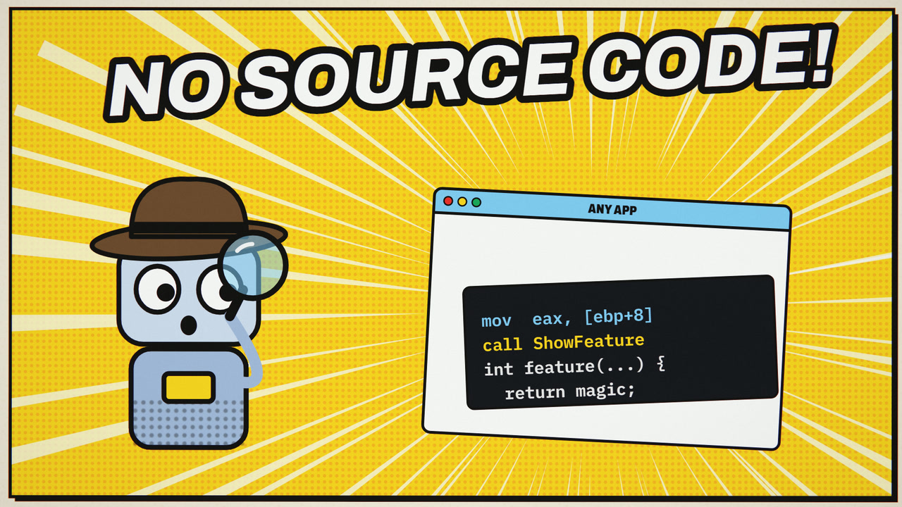
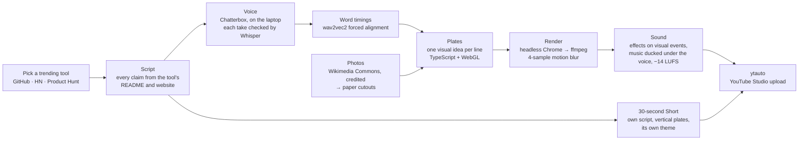

# Hermes

**A YouTube channel that runs from a Windows laptop.** Every video explains one developer tool that is trending this week. The script is fact-checked against the tool's own pages, the narration is an AI voice made on the laptop, the animation is written as code, and a browser robot uploads the result to YouTube Studio.

Channel: **[Tool Man (@tooladay)](https://www.youtube.com/@tooladay)**, one new tool every day.

[](https://youtu.be/6ZxAIGAm9Qo)

**Latest:** [This Free AI Tool Reverse-Engineers Any App](https://youtu.be/6ZxAIGAm9Qo) (1:30) · [the Short](https://youtube.com/shorts/UJ0Iwi7PSdk) (0:30) · about [REA](https://github.com/morluto/rea) (scheduled for 11 Oct, 18:00 IST)

Each video has its own look. The 90-second videos and the 30-second vertical Shorts are written, voiced, animated and rendered separately; a Short is not a reformat of the video.

---

## What's in this repository

| Folder | What it does | Built with |
|---|---|---|
| [`Motion_as_kit/`](Motion_as_kit/) | Makes the videos. Each video is an episode folder with its own script, voice, theme and TypeScript "plates", which draw every frame as a function of time, locked to the voiceover's word timings. Headless Chrome renders them with motion blur. | three.js / WebGL, Vite, Playwright, ffmpeg, Chatterbox, wav2vec2 |
| [`yt-automation/`](yt-automation/) | **ytauto** uploads the videos. It is a queue that fills in the title, description, tags, thumbnail and AI-content disclosure in YouTube Studio through a signed-in Chrome profile, then publishes or schedules. | Python, Playwright, SQLite |
| [`tech-daily/`](tech-daily/) | **techdaily**, the earlier daily pipeline. It collects trending tools from GitHub, Hacker News, Product Hunt, Reddit and Google Trends, researches one, fact-checks a script and builds a HyperFrames video. | Python, Claude Code (`claude -p`), HyperFrames |

[Hermes Agent](https://github.com/NousResearch/hermes-agent) runs the schedule (`ytauto tick` every 10 minutes) and [Claude Code](https://www.anthropic.com/claude-code) does the writing and the coding.

## How a video gets made



1. **Script.** A 90-second video is about 17 lines and 260 words: a hook, how the tool works, an honest catch, and the sign-off. A Short is about 80 words. Each script lives in its episode's `script.json` (for example [the disktree one](Motion_as_kit/episodes/2026-10-04-disktree/script.json)): `text` is what appears on screen, `say` is what the voice reads.
2. **Voice.** [`tts_chatterbox.py`](Motion_as_kit/analysis/tts_chatterbox.py) makes the narration on the laptop with Chatterbox. It records one take per sentence at a lively setting (exaggeration 0.65, cfg 0.4). faster-whisper listens back, and a take that doesn't match its sentence is recorded again. The AnyPS5 pair tried a single ElevenLabs read through vidIQ, cut to length by [`edit_vo.py`](Motion_as_kit/analysis/edit_vo.py). Next to Chatterbox it sounded like a stock AI narrator, so the channel went back. A video reaches 90 seconds through its script, never by speeding the voice up.
3. **Timing.** [`align_vo.py`](Motion_as_kit/analysis/align_vo.py) force-aligns the script to the audio, so every word has a start and an end. Cuts land in the pause before a line, and each animation starts on the word it illustrates.
4. **Photos.** When a real object helps (a console, a circuit board, a graphics card), its photo comes from Wikimedia Commons under a free licence and is credited in the description. [`cutouts.py`](Motion_as_kit/analysis/cutouts.py) keys out the background and turns each photo into a sticker, a print or a torn clipping, with its own shadow.
5. **Plates.** Each line gets its own scene in the episode's `scenes/`, built on the shared toolkit in [`app/src/scenes/`](Motion_as_kit/app/src/scenes/). For example:
   - magpie: a plotter pen writing "married" in cursive, a gateway with packets flowing both ways, a travel-adapter analogy, an operator's switchboard;
   - disktree: a race against WizTree on a stopwatch, a treemap that grows box by box and dives into folders, amber hatching for reclaimable space, mark → review → delete with a rescan;
   - the disktree Short: giant slammed words on yellow paper, comic-thick tiles, snap-zoom dives;
   - AnyPS5: a paper collage on a desk. Photo cutouts drop in and land with a shadow, red string pins the PS5 to a laptop, a marker circles the chip and crosses out what isn't included, headlines are ransom letters, and the captions sit on torn paper strips ([`_collage.ts`](Motion_as_kit/app/src/scenes/_collage.ts));
   - the AnyPS5 Short: a glitching screen with RGB-split type and photos that tear between frames.
   - openGym: a garage-gym desk on kraft paper. A drawn body map lights up by training volume, turns orange where muscles are recovering and greys out the legs; plates slide onto a drawn barbell for the plate math; receipts get stamped SUBSCRIPTION;
   - the openGym Short: an electric-blue sports court with chalk lines, giant chalk-white and lime words slammed in on the beat, and every line paired with a picture that explains it.
   - REA: a motion comic on newsprint. Ink-bordered panels land one by one while the camera travels across the page; Ben-Day halftone, speed lines, onomatopoeia (BOOM!, ZIP!, EXACT!), speech and thought balloons, and a robot detective in a fedora as the AI agent. The narration is lettered into yellow caption boxes, word by word;
   - the REA Short: one continuous group chat. Tool Man's lines arrive as typing dots and then bubbles that letter in as they're spoken, the viewer reacts in blue bubbles, and the evidence arrives as photo messages.

   Each episode picks a theme in `episode.json`: `signal` (ink and orange), `blueprint` (navy and cyan), `pop` (yellow paper, black and pink), `scope` (oscilloscope green), `riso` (risograph pink and blue), `collage` (paper, ink and red marker), `glitch` (black, hot pink and cyan), `kraft` (kraft paper, red marker, lime), `court` (electric blue, chalk white, lime), `comic` (newsprint, ink, comic red and yellow) or `chat` (a messaging screen).
6. **Render.** [`render-node.mjs`](Motion_as_kit/app/scripts/render-node.mjs) renders in resumable 10-second parts and joins them without re-encoding.
7. **Sound.** [`sfx_mix.py`](Motion_as_kit/analysis/sfx_mix.py) plays the episode's `sfx_cues.py`: every effect sits on something you see. A royalty-free music bed, generated with vidIQ, dips whenever the voice speaks. The mix is −14 LUFS.
8. **Captions.** [`make_srt.py`](Motion_as_kit/analysis/make_srt.py) writes the word timings as an SRT file, so the captions spell names and numbers the way the screen does.
9. **Upload.** `ytauto add … --visibility public` then `ytauto upload`. The title puts the search phrase first, the first two lines of the description repeat it, and the description ends with three hashtags, plus #Shorts on a Short (following the [claude-youtube](https://github.com/AgriciDaniel/claude-youtube) SEO notes).

## Make one yourself

Requirements: Windows 10/11 or macOS, Node 24, Google Chrome, ffmpeg with libx264, Python 3.11+ with [uv](https://docs.astral.sh/uv/), and a Python 3.11 environment with `chatterbox-tts` and `faster-whisper` for the voice.

```bash
cd Motion_as_kit/app && npm install && cd ..
export EPISODE=2026-10-04-disktree      # an episode folder in Motion_as_kit/episodes/

# 1. write the episode's script.json, then make the voice: Chatterbox on the laptop,
#    or one ElevenLabs read cut to length with analysis/edit_vo.py (see the Motion_as_kit README)
python analysis/tts_chatterbox.py

# 2. word timings and loudness envelopes
uv run --no-project --with onnxruntime --with numpy python analysis/align_vo.py
uv run --no-project --with numpy python analysis/audio_vo.py

# 3. write the plates and preview them (space = play, [ ] = previous/next plate)
cd app && npx vite

# 4. render in resumable parts, then sound and mux (output in episodes/$EPISODE/out/)
node scripts/render-node.mjs parts --fps 30 --part-sec 10 --samples 4 --noaudio
cd .. && uv run --no-project --with numpy python analysis/sfx_mix.py
E=episodes/$EPISODE/out
ffmpeg -i $E/picture.mp4 -i $E/mix.wav -map 0:v -map 1:a -c:v copy -c:a aac -b:a 256k $E/final.mp4
uv run --no-project --with numpy python analysis/check_video.py $E/final.mp4
python analysis/make_srt.py             # captions, in episodes/$EPISODE/publish/captions.en.srt

# 5. upload
../yt-automation/.venv/Scripts/ytauto.exe add $E/final.mp4 --metadata episodes/$EPISODE/publish/metadata.json --thumbnail episodes/$EPISODE/publish/thumbnail.jpg --visibility public
```

The alignment model (`analysis/models/w2v2_base_960h_q.onnx`) and the sound-effect library (`audio/sfx/`) come with the Motion as Code starter kit and are not in this repository. The [Motion_as_kit README](Motion_as_kit/README.md) covers the details, and [ytauto's README](yt-automation/README.md) covers signing in and scheduling.

## Published

| Date | Video | Short | Tool |
|---|---|---|---|
| 11 Oct 2026 | [This Free AI Tool Reverse-Engineers Any App](https://youtu.be/6ZxAIGAm9Qo) | [This AI Takes Apart Any App](https://youtube.com/shorts/UJ0Iwi7PSdk) | [REA](https://github.com/morluto/rea) · [video episode](Motion_as_kit/episodes/2026-10-11-rea/) · [Short episode](Motion_as_kit/episodes/2026-10-11-rea-short/) |
| 10 Oct 2026 | [This Free Workout Tracker Knows You Skipped Leg Day](https://youtu.be/-uAf9tqI8aU) | [This Free Gym App Knows You Skip Legs](https://youtube.com/shorts/FRRxkiQ8wfM) | [openGym](https://github.com/DuarteSantos8/openGym) · [video episode](Motion_as_kit/episodes/2026-10-10-opengym/) · [Short episode](Motion_as_kit/episodes/2026-10-10-opengym-short/) |
| 9 Oct 2026 | [PS5 Games on PC With No Emulator? How AnyPS5 Does It](https://youtu.be/kCeu58HlppU) | [PS5 Games on PC, No Emulator](https://youtube.com/shorts/1lL9B3y0eJQ) | [AnyPS5](https://github.com/boykopovar/AnyPS5) · [video episode](Motion_as_kit/episodes/2026-10-09-anyps5/) · [Short episode](Motion_as_kit/episodes/2026-10-09-anyps5-short/) |
| 4 Oct 2026 | [This Free ElevenLabs Alternative Runs on Your Laptop](https://youtu.be/2CW_zb6y_ps) | [This Free App Copies a Voice From a 10-Second Clip](https://youtube.com/shorts/rlxaVkBudiM) | [VoiceStudio](https://github.com/debpalash/VoiceStudio) · [video episode](Motion_as_kit/episodes/2026-10-04-voicestudio/) · [Short episode](Motion_as_kit/episodes/2026-10-04-voicestudio-short/) |
| 4 Oct 2026 | [Shopify's Founder Built a Free Disk Cleaner: 4 Million Files in 3.4 Seconds](https://youtu.be/4MmSMJ2c2aQ) | [Your Disk Is Full. But Full of What?](https://youtube.com/shorts/vZ9y7XhO3pc) | [disktree](https://github.com/tobi/disktree) · [video episode](Motion_as_kit/episodes/2026-10-04-disktree/) · [Short episode](Motion_as_kit/episodes/2026-10-04-disktree-short/) |
| 3 Oct 2026 | [Codex on DeepSeek, Claude Code on Kimi: How This Free 15 MB App Does It](https://youtu.be/TuOnUlJSWho) | [Short (reframed)](https://youtube.com/shorts/Y63pJ4viW14) | [magpie](https://github.com/yetone/magpie) · [episode](Motion_as_kit/episodes/2026-10-03-magpie/) |

## How the videos are doing

YouTube Analytics for the channel from its first upload (27 September) to 10 October 2026, read through the vidIQ connector. Analytics runs a day or two behind, so the AnyPS5 pair's row uses YouTube's public counters (10 October, 13:05 IST), and the openGym pair isn't counted yet.

| Upload | Length | Views | Engaged views | Average watched | Of its length | Likes | Subscribers gained |
|---|---|---:|---:|---:|---:|---:|---:|
| [AnyPS5](https://youtu.be/kCeu58HlppU) (public counter, after ~26 h) | 1:30 | **2,677** | | | | 4 | |
| [AnyPS5 Short](https://youtube.com/shorts/1lL9B3y0eJQ) (public counter, after ~26 h) | 0:30 | **2,372** | | | | 32 | |
| [magpie](https://youtu.be/TuOnUlJSWho) | 1:26 | 70 | 42 | 0:43 | 50% | 2 | 0 |
| [magpie Short](https://youtube.com/shorts/Y63pJ4viW14) (the video, reframed) | 1:26 | 358 | 140 | 0:42 | 50% | 12 | 2 |
| [disktree](https://youtu.be/4MmSMJ2c2aQ) | 1:30 | 21 | 19 | 0:53 | 59% | 1 | 3 |
| [disktree Short](https://youtube.com/shorts/vZ9y7XhO3pc) | 0:30 | 190 | 56 | 0:24 | 81% | 1 | 0 |
| [VoiceStudio](https://youtu.be/2CW_zb6y_ps) | 1:30 | 39 | 30 | 0:29 | 32% | 1 | 2 |
| [VoiceStudio Short](https://youtube.com/shorts/rlxaVkBudiM) | 0:30 | 242 | 57 | 0:19 | 65% | 9 | 1 |
| [Laya](https://youtu.be/Yb5DsnWOCMk) (techdaily) | 3:18 | 14 | 11 | 1:12 | 37% | 0 | 0 |
| **Channel in Analytics** | | **934** | **355** | | | **26** | **8** |

YouTube counts any playback as a view; engaged views is its stricter count of people who kept watching. In all, Analytics shows 223 minutes watched, 6 comments and 6 shares.

What the numbers say so far:
- **AnyPS5 broke out.** It was the top trending repository on GitHub that week, and the pair passed 5,000 views in about a day: more than five times everything before it combined. Its video is the first in the paper-collage style.
- **Shorts bring the steady audience.** Before AnyPS5 they had 85% of the views (790 of 934).
- **Native 30-second Shorts hold viewers better than a reframed video.** The disktree Short keeps viewers for 81% of its length and the VoiceStudio Short 65%. The magpie Short, the full video reframed to vertical, holds 50%. That is why every Short since has its own script and plates.
- **The 90-second videos get fewer views but more of each viewer's time.** disktree holds viewers longest (59%) and brought 3 of the channel's 8 new subscribers.

## Lessons from running this on a laptop

- **Bun can't drive Chrome on Windows.** Playwright's pipe and WebSocket connections both hang under Bun there. The renderer therefore runs on Node and sends frames to ffmpeg over HTTP, with 4 frames in flight.
- **Laptops sleep in the middle of renders.** On battery, an idle Windows laptop drops into Modern Standby, which kills headless Chrome. Keep the machine awake while rendering. Renders are split into 10-second parts so an interrupted run resumes where it stopped.
- **Rendering is slow on a laptop GPU, and twice as slow on battery.** On an Intel Iris Xe, 4-sample motion blur renders at about 1.2 frames per second on power, so a 90-second video takes roughly 40 minutes. The paper-collage plates are heavier (photo cutouts with soft shadows, a paper shader): the AnyPS5 video rendered at 0.8 frames per second plugged in and 0.5 on battery, 64 minutes in all. A Chatterbox voice takes 25–45 minutes on the CPU. Keep the laptop plugged in.
- **Background jobs stop after 30 minutes.** Long steps are resumable: voice takes are cached, and renders resume at the next unfinished part.
- **Choose the voice by ear, not by brand.** A premium ElevenLabs voice sounded like every other AI channel; the free Chatterbox voice, made on this laptop, sounded natural.
- **Don't edit a plate while its episode renders.** Vite reloads the page, and the render dies with "Failed to fetch". Render one episode at a time and leave its files alone until it finishes.
- **Don't mux with `-shortest`.** With a WAV mix that ends a few milliseconds before the picture, ffmpeg cut the last four frames of a Short. The voice and the picture are the same length by construction, so the plain mux is right.
- **Chatterbox needs `setuptools<80`.** Its audio watermarker still imports `pkg_resources`.
- **Whisper mishears tech names.** It hears "Claude" as "cloud", "Codex" as "codecs" and numbers as digits. The voice check compares letters through a fix-up table, so good takes aren't thrown away.

## Credits

- Engine and visual language: [pdoom-video](https://github.com/mexicat/pdoom-video) by mexicat (Giacomo Magnanini), MIT. See [`LICENSE.pdoom-engine`](Motion_as_kit/LICENSE.pdoom-engine).
- Workflow: the *Motion as Code* starter kit (voiceover → alignment → plates → render → sound).
- Voice: [Chatterbox](https://github.com/resemble-ai/chatterbox) by Resemble AI (MIT). Speech recognition: [faster-whisper](https://github.com/SYSTRAN/faster-whisper). Alignment: wav2vec2-base-960h (ONNX).
- [three.js](https://threejs.org), [Vite](https://vite.dev), [Playwright](https://playwright.dev), [ffmpeg](https://ffmpeg.org), [HyperFrames](https://github.com/heygen-com/hyperframes).
- Fonts: Archivo, IBM Plex Mono and Cormorant Garamond (SIL OFL), plus the EMS and Hershey single-stroke fonts.

## Licence

The code in this repository is MIT-licensed: see [`LICENSE`](LICENSE). Two exceptions: the engine in `Motion_as_kit/app/src/engine/` is MIT-licensed by its own author (see [`LICENSE.pdoom-engine`](Motion_as_kit/LICENSE.pdoom-engine)), and files that came with the Motion as Code starter kit keep their authors' terms. Fonts are under the SIL Open Font License.

## Not in this repository

The repository is public, so these stay on the laptop:
- browser profiles (the signed-in YouTube session);
- the job database;
- API keys (`.env`);
- rendered media;
- virtual environments, `node_modules` and model weights;
- the starter kit's original scenes, voiceover and sound effects;
- third-party screenshots used in a video (fetched from the tool's own repository);
- the photos behind the paper cutouts (each episode's `img/credits.json` lists the source, author and licence of every photo);
- the voice and music audio (since the AnyPS5 pair; the word timings stay in each episode's `data/`).

See [`.gitignore`](.gitignore).
